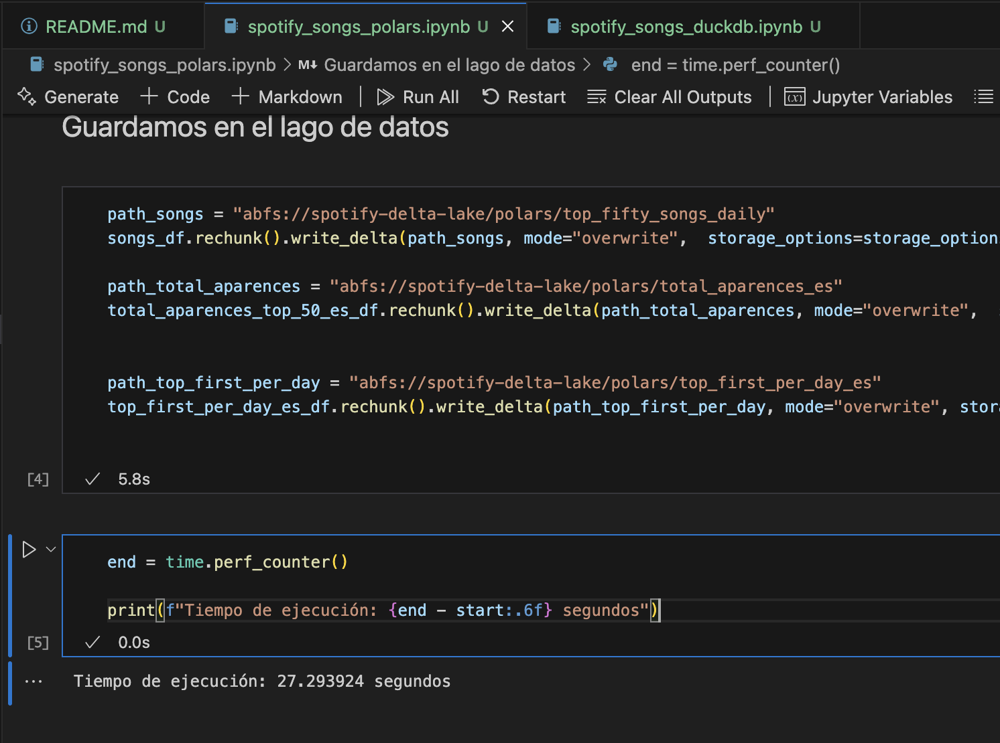
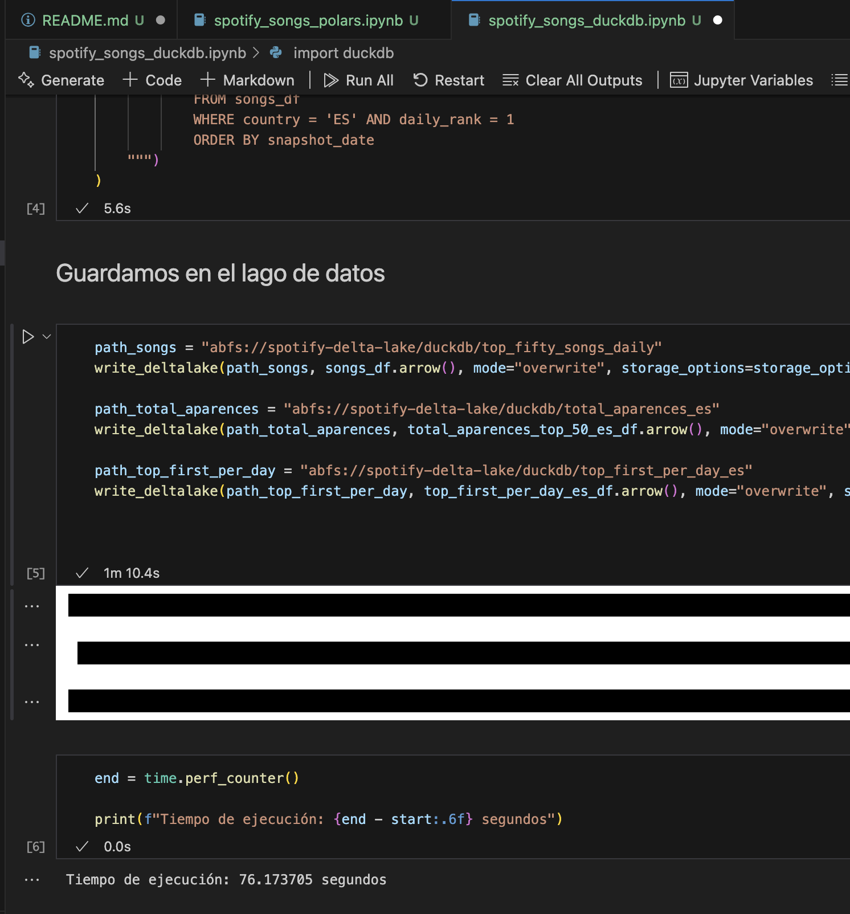

# Spotify Songs

La idea de este repositorio es explorar el uso de las librerías [DuckDB](https://duckdb.org/docs/stable/clients/python/overview.html) y [Polars](https://docs.pola.rs/api/python/stable/reference/index.html).
Además, de realizar una serie de operaciones, quiero ver cómo se comporta cada librería en cuanto a velocidad de procesado de información. Para ello, he usado un dataset de [Canciones de Spotify](https://www.kaggle.com/datasets/asaniczka/top-spotify-songs-in-73-countries-daily-updated) disponible en [Kaggle](https://www.kaggle.com/). Este dataset lo he guardado en un contenedor de Azure y ocupa 404 MB.
Para terminar, guardo las operaciones sobre el dataframe en un Storage Account de Azure, en formato Delta Lake.

Los tres dataframes creados son:

1. Todas las canciones en el top 50 diario para todos los paises
2. El total de apariciones de cada canción en el top 50 diario para España.
3. Todos los top 1 de caciones en el periodo de tiempo para España.

En cuanto a comparaciones de tiempo, en mi caso, Polars ha sido por mucha diferencia bastante más rápido.

##### Tiempo de ejecución de Polars: 27 segundos

##### Tiempo de ejecución de DuckDB: 76 segundos
